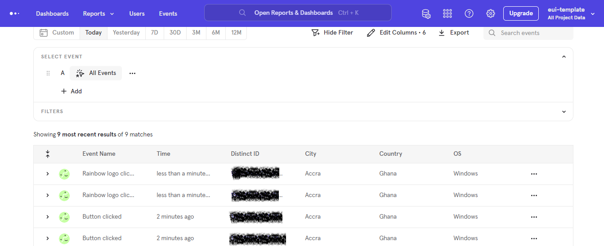

# What is Mixpanel?
It is an analytic tool that gets you insighst on how users interact with your digital product. These insights will help enable you to make decisions on how your users can get the best out of your digital productand and eventually retain them.

Get an overview of the Mixpanel: https://developer.mixpanel.com/docs/what-is-mixpanel 

### How to set it up?

- On the Mixpanel dashboard, create a project and get the project token.

- Run `npm install --save mixpanel-browser` or `yarn add mixpanel-browser` to install the package;

- Import Mixpanel in your project:
    ` import mixpanel from 'mixpanel-browser';`

- Initianilze Mixpanel anywhere you wish to use it `mixpanel.init('YOUR_TOKEN'}); ` replace the token with your project's token.

### Send events?
Let's track how many times a button has been clicked in our App.

- Add an event listener to the button we want to track `<button onClick={btnClick}>Button</button>`
- Call mixpanel in the `btnClick` function and pass it an `event name`. In our case, we named it `Button clicked`. The full code should look like this:

``` 
import mixpanel from 'mixpanel-browser';

mixpanel.init('YOUR_TOKEN'); 

function App() {

  let btnClick = (e) => {
    mixpanel.track("Button clicked")
  }
  return (
    <>
      <Button colorScheme='blue' onClick={btnClick}>Button</Button>
    </>
  );
}

export default App;

```

### Check for successful events
- To confrim your connection to Mixpanel was successful, check your `network tab` for a status `200`


- Go back to Mixpanel project dashboard click on `Events` to see all your events.


### Important links
- https://www.youtube.com/watch?v=H35FwN51tWQ
https://help.mixpanel.com/hc/en-us/articles/360021749032#music-finder 

